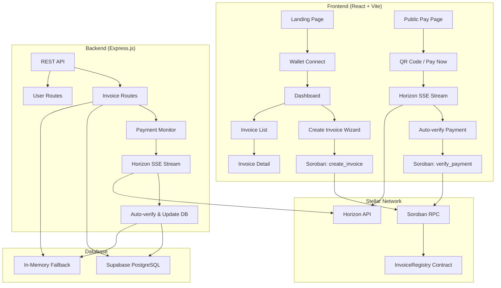
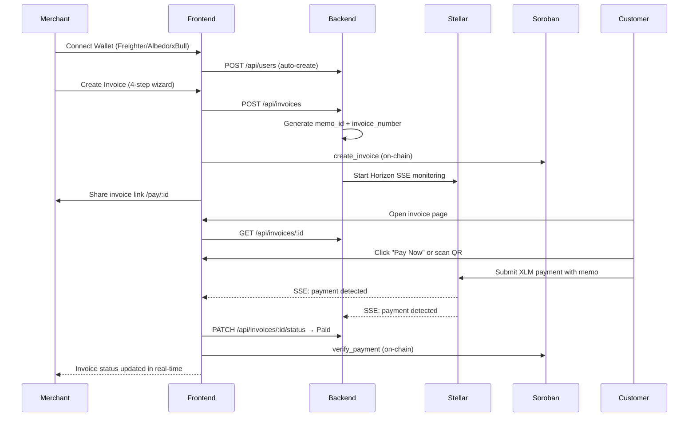
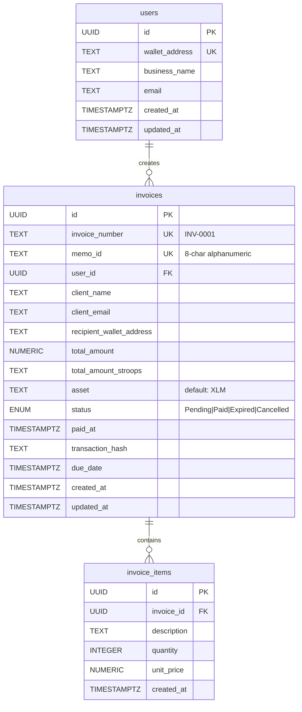

# InvoiceChain — Decentralized Invoicing on Stellar

> **Create blockchain-backed invoices. Get paid in XLM. Auto-verified on-chain.**

InvoiceChain is a decentralized invoicing platform built on the **Stellar blockchain** that enables businesses, freelancers, agencies, and merchants to create secure, blockchain-backed invoices and receive payments in Stellar assets with **automatic verification**.

Instead of manually sharing wallet addresses and checking blockchain transactions to identify who has paid, merchants simply create an invoice that is assigned a **unique on-chain invoice ID**. A shareable invoice page is generated containing all payment details, along with a **Pay Now button** and a **QR code** for seamless payments. Customers can open the invoice, review its details, and pay directly from any compatible Stellar wallet in just a few clicks.

Once the payment is completed, the platform **continuously monitors the Stellar blockchain**, verifies that the transaction matches the invoice based on the recipient wallet, asset, amount, and invoice ID (memo), and **automatically updates the invoice status** from `Pending` to `Paid` in real time. This eliminates manual reconciliation, reduces payment errors, and provides merchants with a simple, transparent, and reliable way to manage crypto invoices.

Designed as a modern SaaS application, InvoiceChain combines a clean and responsive user experience with the speed, transparency, and security of Stellar to make blockchain-based invoicing practical for everyday business use.

---

## 🔗 Quick Links

| Resource | Link |
|----------|------|
| 🌐 **Live Demo** | [stellar-invoice-ecru.vercel.app](https://stellar-invoice-ecru.vercel.app) |
| 📜 **Contract Address** | [`CCUHMHOIOOOGFJBVOKGMTE424QTDY6B2EX6HO2X5D52IDPL2X4UQZIBM`](https://stellar.expert/explorer/testnet/contract/CCUHMHOIOOOGFJBVOKGMTE424QTDY6B2EX6HO2X5D52IDPL2X4UQZIBM) |
| 🔗 **Contract Interaction Tx Hash** | [`19f31c163881415628499a284fc7f9846e942253592e0a8c8d6f37f4493be888`](https://stellar.expert/explorer/testnet/tx/19f31c163881415628499a284fc7f9846e942253592e0a8c8d6f37f4493be888) |
| 📊 **Stellar Explorer** | [stellar.expert/explorer/testnet](https://stellar.expert/explorer/testnet) |

---

## 📸 Demo & Screenshots

### 🖥️ Desktop UI
<!-- Replace the path below with actual screenshot -->
```
📌 Add screenshot: Desktop dashboard view showing invoices list
   Save to: screenshots/desktop-dashboard.png
```

### 📱 Mobile Responsive UI
<!-- Replace the path below with actual screenshot -->
```
📌 Add screenshot: Mobile responsive view of the invoice/pay page
   Save to: screenshots/mobile-responsive.png
```

### ✅ CI/CD Pipeline Running
<!-- 
HOW TO GET THIS SCREENSHOT:
1. Go to your GitHub repository
2. Click on the "Actions" tab at the top
3. Click on the most recent successful workflow run (green checkmark)
4. You will see 3 jobs: "Frontend (Lint & Build)", "Backend (Lint & Build)", "Contract (Build & Test)"
5. Take a screenshot showing all 3 jobs with green checkmarks
6. Save it as screenshots/cicd-pipeline.png
-->
```
📌 Add screenshot: GitHub Actions tab showing successful CI pipeline
   Save to: screenshots/cicd-pipeline.png
```

### 🧪 Test Output (3+ Passing Tests)
<!-- 
HOW TO GET THIS SCREENSHOT:
1. Open a terminal and cd into the contract/ directory
2. Run: cargo test
3. Take a screenshot showing the test results (12 tests passing)
4. Save it as screenshots/test-output.png
-->
```
📌 Add screenshot: Terminal showing cargo test output with 12 passing tests
   Save to: screenshots/test-output.png
```

### 🎬 Demo Video
<!-- Replace with your demo video link -->
```
📌 Add link: 1–2 minute demo video showing the full invoice flow
   Upload to: YouTube or Loom and paste the link below
```
> 🎥 **Demo Video**: `<your-video-link>`

---

## ✨ Features

### Core Invoicing
- 🧾 **Invoice CRUD** — 4-step creation wizard (Client Details → Line Items → Payment Config → Review & Submit)
- 📋 **Invoice List** — Filterable, sortable dashboard with status badges, search, and pagination
- 🔍 **Invoice Detail** — Full invoice breakdown with line items, payment status, and blockchain links
- 📊 **Dashboard Analytics** — Revenue charts, status distribution, and recent activity via Recharts

### Blockchain & Payments
- 🔗 **Wallet Connect** — Multi-wallet support via [StellarWalletsKit](https://github.com/nichanank/stellar-wallets-kit) (Freighter, Albedo, xBull, LOBSTR, etc.)
- 💳 **Pay Now Button** — One-click payment directly from the shareable invoice page
- 📱 **QR Code Payments** — SEP-0007 compliant payment URIs for mobile wallet scanning
- ⚡ **Real-time Payment Detection** — Dual-layer monitoring using Horizon SSE streams (client + server)
- 📜 **On-chain Invoice Registry** — Soroban smart contract records invoice lifecycle (create, verify, cancel)
- 🔄 **Automatic Reconciliation** — Matches payments by recipient wallet, asset, amount, and memo ID

### Infrastructure
- 🖥️ **Server-side Payment Monitor** — Backend Horizon stream ensures payments are verified even if the browser closes
- 🗄️ **Dual Storage Mode** — Supabase (PostgreSQL + Realtime) with automatic in-memory fallback
- 🔐 **Row Level Security** — Supabase RLS policies for data isolation
- 📡 **Health Check Endpoint** — `GET /api/health` reports Supabase connection and active monitor count
- ⚙️ **CI/CD Pipeline** — GitHub Actions with 3 parallel jobs (Frontend, Backend, Contract)

### UX & Design
- 📱 **Mobile Responsive** — Fully responsive design from mobile to desktop
- 🎨 **Modern UI** — Tailwind CSS 4 + Motion (Framer Motion) animations
- 🔔 **Toast Notifications** — Real-time feedback for all user actions
- ⚡ **Skeleton Loading** — Smooth loading states across all pages

---

## 🏗️ Architecture



### System Flow



---

## 🛠️ Tech Stack

### Frontend
| Technology | Purpose |
|-----------|---------|
| [React 19](https://react.dev) | UI framework with latest features |
| [Vite 6](https://vite.dev) | Lightning-fast build tool & HMR |
| [TypeScript 5.9](https://typescriptlang.org) | Type safety across the codebase |
| [Tailwind CSS 4](https://tailwindcss.com) | Utility-first styling |
| [Motion (Framer Motion)](https://motion.dev) | Smooth animations & transitions |
| [React Router 7](https://reactrouter.com) | Client-side routing |
| [Lucide React](https://lucide.dev) | Beautiful, consistent icons |
| [Recharts](https://recharts.org) | Dashboard analytics charts |
| [qrcode.react](https://github.com/zpao/qrcode.react) | QR code generation for payments |
| [date-fns](https://date-fns.org) | Lightweight date formatting |
| [StellarWalletsKit](https://github.com/nichanank/stellar-wallets-kit) | Multi-wallet connection (Freighter, Albedo, xBull, LOBSTR) |
| [@stellar/stellar-sdk](https://github.com/nichanank/stellar-wallets-kit) | Stellar Horizon & Soroban RPC client |

### Backend
| Technology | Purpose |
|-----------|---------|
| [Express.js 4](https://expressjs.com) | REST API server |
| [TypeScript](https://typescriptlang.org) | Type-safe backend |
| [tsx](https://github.com/privatenumber/tsx) | TypeScript execution (dev) |
| [@stellar/stellar-sdk](https://stellar.github.io/js-stellar-sdk/) | Horizon SSE payment monitoring |
| [@supabase/supabase-js](https://supabase.com/docs/reference/javascript) | Database client with realtime |
| [uuid](https://github.com/uuidjs/uuid) | Unique ID generation |
| [dotenv](https://github.com/motdotla/dotenv) | Environment variable management |
| [cors](https://github.com/expressjs/cors) | Cross-origin resource sharing |

### Blockchain
| Technology | Purpose |
|-----------|---------|
| [Stellar Testnet](https://stellar.org) | High-speed, low-fee payment network |
| [Soroban](https://soroban.stellar.org) | Smart contract platform on Stellar |
| [Rust](https://rust-lang.org) | Smart contract language |
| [soroban-sdk 22.0](https://docs.rs/soroban-sdk) | Soroban contract development kit |

### Database
| Technology | Purpose |
|-----------|---------|
| [Supabase](https://supabase.com) | Hosted PostgreSQL + Realtime subscriptions |
| In-Memory Store | Zero-config fallback for development |

---


## 📜 Smart Contract (Soroban)

The `InvoiceRegistry` smart contract is written in **Rust** using **Soroban SDK v22.0** and deployed to the **Stellar Testnet**.

### Contract Address

```
CCUHMHOIOOOGFJBVOKGMTE424QTDY6B2EX6HO2X5D52IDPL2X4UQZIBM
```

> 🔗 [View on Stellar Expert](https://stellar.expert/explorer/testnet/contract/CCUHMHOIOOOGFJBVOKGMTE424QTDY6B2EX6HO2X5D52IDPL2X4UQZIBM)


### On-Chain Data Model

```rust
pub struct InvoiceData {
    pub invoice_id: String,       // Unique invoice identifier
    pub memo_id: String,          // 8-char alphanumeric memo for payment matching
    pub recipient: Address,       // Merchant's Stellar wallet address
    pub amount: i128,             // Payment amount in stroops (1 XLM = 10^7 stroops)
    pub asset: Symbol,            // Asset code (e.g., "XLM")
    pub status: InvoiceStatus,    // Pending | Paid | Cancelled
    pub creator: Address,         // Invoice creator's address
    pub tx_hash: String,          // Payment transaction hash (set on verification)
    pub created_at: u64,          // Ledger timestamp at creation
    pub paid_at: u64,             // Ledger timestamp at payment verification
}
```


**Create Invoice — Request Body:**
```json
{
  "invoice": {
    "user_id": "uuid",
    "client_name": "John Doe",
    "client_email": "john@example.com",
    "recipient_wallet_address": "GABC...WXYZ",
    "total_amount": 100.50,
    "total_amount_stroops": "1005000000",
    "asset": "XLM",
    "due_date": "2026-07-15T00:00:00Z"
  },
  "items": [
    { "description": "Web Development", "quantity": 10, "unit_price": 10.05 }
  ]
}
```

**Update Status — Request Body:**
```json
{
  "status": "Paid",
  "transaction_hash": "abc123def456..."
}
```

Valid statuses: `Pending`, `Paid`, `Expired`, `Cancelled`

---

## 🗄️ Database Schema



**Security**: Row Level Security (RLS) enabled on all tables. Invoices are publicly readable (for the payment page), but only the creator can manage them.

---

## 🚀 Getting Started

### Prerequisites

| Tool | Version | Purpose |
|------|---------|---------|
| [Node.js](https://nodejs.org) | 20+ | Frontend & Backend runtime |
| [Rust](https://rustup.rs) | Latest stable | Smart contract compilation |
| [Soroban CLI](https://soroban.stellar.org/docs/getting-started/setup) | Latest | Contract deployment & interaction |
| [Stellar Wallet](https://freighter.app) | — | Freighter, Albedo, xBull, or LOBSTR |

### 1. Clone the Repository

```bash
git clone https://github.com/<your-username>/steallarInvoice.git
cd steallarInvoice
```

### 2. Frontend Setup

```bash
cd frontend
cp .env.example .env    # Configure your environment variables
npm install
npm run dev             # → http://localhost:5173
```

### 3. Backend Setup

```bash
cd backend
cp .env.example .env    # Configure your environment variables
npm install
npm run dev             # → http://localhost:3001
```

### 4. Smart Contract

```bash
cd contract

# Install Soroban CLI
cargo install --locked soroban-cli

# Add WASM target
rustup target add wasm32-unknown-unknown

# Build
cargo build --release --target wasm32-unknown-unknown

# Run tests
cargo test

# Deploy to testnet
stellar keys generate deployer --network testnet --fund
bash deploy.sh
```

### 5. Database Setup

Without Supabase, the backend uses an **in-memory store** automatically. To enable persistent storage:

1. Create a [Supabase project](https://supabase.com)
2. Run the SQL from [`supabase-schema.sql`](supabase-schema.sql) in the Supabase SQL Editor
3. Add the connection details to your `.env` files

---

## 🔄 CI/CD Pipeline

InvoiceChain uses **GitHub Actions** for continuous integration with 3 parallel jobs:

```yaml
# .github/workflows/ci.yml
Jobs:
  ├── Frontend (Lint & Build)     # npm ci → eslint → tsc --noEmit → vite build
  ├── Backend (Lint & Build)      # npm ci → tsc --noEmit
  └── Contract (Build & Test)     # cargo build (WASM) → cargo test
```

### Pipeline Triggers
- **Push** to `main` or `develop` branches
- **Pull requests** targeting `main`

## 🧪 Testing

### Smart Contract Tests (12 tests)

The Soroban contract includes **12 comprehensive unit tests** covering all contract functions and edge cases:

```bash
cd contract
cargo test
```

| # | Test | What It Verifies |
|---|------|-----------------|
| 1 | `test_create_and_get_invoice` | Creates an invoice and retrieves it by ID |
| 2 | `test_get_invoice_by_memo` | Retrieves an invoice using its memo ID |
| 3 | `test_duplicate_memo_fails` | Prevents duplicate memo IDs (returns `AlreadyExists`) |
| 4 | `test_verify_payment` | Marks invoice as Paid with transaction hash |
| 5 | `test_verify_payment_idempotent` | Verifying an already-paid invoice succeeds (idempotent) |
| 6 | `test_cancel_invoice` | Cancels a pending invoice |
| 7 | `test_cancel_by_non_creator_fails` | Only the creator can cancel (returns `Unauthorized`) |
| 8 | `test_cancel_paid_invoice_fails` | Cannot cancel a paid invoice (returns `AlreadyPaid`) |
| 9 | `test_verify_cancelled_invoice_fails` | Cannot verify a cancelled invoice (returns `AlreadyCancelled`) |
| 10 | `test_invoice_count` | Tracks total invoice count correctly |
| 11 | `test_invalid_amount_fails` | Rejects zero/negative amounts (returns `InvalidAmount`) |
| 12 | `test_not_found` | Returns `NotFound` for nonexistent invoice |

### Expected Output

```
running 12 tests
test test::test_cancel_by_non_creator_fails ... ok
test test::test_cancel_invoice ... ok
test test::test_cancel_paid_invoice_fails ... ok
test test::test_create_and_get_invoice ... ok
test test::test_duplicate_memo_fails ... ok
test test::test_get_invoice_by_memo ... ok
test test::test_invalid_amount_fails ... ok
test test::test_invoice_count ... ok
test test::test_not_found ... ok
test test::test_verify_cancelled_invoice_fails ... ok
test test::test_verify_payment ... ok
test test::test_verify_payment_idempotent ... ok

test result: ok. 12 passed; 0 failed; 0 ignored; 0 measured; 0 filtered out
```


## 📄 License

This project is licensed under the **MIT License** — see the [LICENSE](LICENSE) file for details.

---
