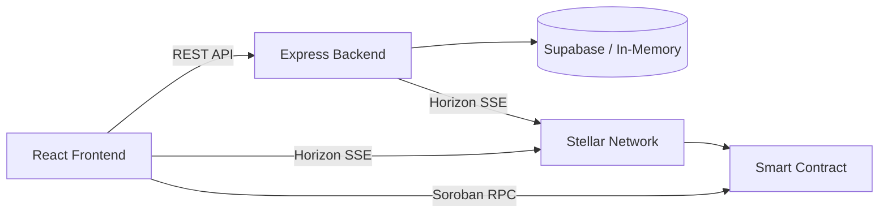

# InvoiceChain

Blockchain-backed invoicing platform built on the Stellar network. Create, share, and collect XLM payments with on-chain verification via Soroban smart contracts.

## Architecture

```
steallarInvoice/
├── frontend/          # React + Vite + Tailwind CSS
├── backend/           # Express.js REST API
├── contract/          # Soroban smart contract (Rust)
└── supabase-schema.sql
```



## Tech Stack

| Layer | Technology |
|-------|-----------|
| Frontend | React 19, Vite, Tailwind CSS 4, React Router, Recharts |
| Backend | Express.js, TypeScript, Supabase (with in-memory fallback) |
| Blockchain | Stellar Testnet, Soroban smart contracts, `@stellar/stellar-sdk` |
| Wallet | StellarWalletsKit (Freighter, Albedo, xBull, etc.) |
| Database | Supabase (PostgreSQL + Realtime) or in-memory store |

## Features

- **Wallet Connect** — Multi-wallet support via StellarWalletsKit
- **Invoice CRUD** — 4-step creation wizard, filterable list, detail view
- **QR Payment** — SEP-0007 compliant payment URIs
- **Real-time Detection** — Horizon SSE streams detect payments automatically
- **On-chain Registry** — Soroban contract records invoice lifecycle
- **Server-side Monitor** — Backend Horizon stream ensures payments are verified even if the browser closes

## Setup

### Prerequisites

- Node.js 20+
- Rust + `soroban-cli` (for contract development)
- A Stellar testnet wallet (e.g., Freighter)

### Frontend

```bash
cd frontend
cp .env.example .env    # Fill in your values
npm install
npm run dev             # http://localhost:5173
```

### Backend

```bash
cd backend
cp .env.example .env    # Fill in your values
npm install
npm run dev             # http://localhost:3001
```

### Smart Contract

```bash
cd contract
cargo build --release --target wasm32-unknown-unknown
cargo test
# Deploy to testnet:
bash deploy.sh
```

## Environment Variables

### Frontend (`frontend/.env`)

| Variable | Description |
|----------|-------------|
| `VITE_SUPABASE_URL` | Supabase project URL |
| `VITE_SUPABASE_ANON_KEY` | Supabase anonymous key |
| `VITE_SOROBAN_CONTRACT_ID` | Deployed Soroban contract ID |
| `VITE_STELLAR_NETWORK` | `TESTNET` or `PUBLIC` |

### Backend (`backend/.env`)

| Variable | Description |
|----------|-------------|
| `PORT` | Server port (default: 3001) |
| `SUPABASE_URL` | Supabase project URL |
| `SUPABASE_SERVICE_ROLE_KEY` | Supabase service role key |
| `SOROBAN_CONTRACT_ID` | Deployed Soroban contract ID |
| `STELLAR_NETWORK` | `TESTNET` or `PUBLIC` |

## Development

The backend works without Supabase using an in-memory data store. Set `SUPABASE_URL` and `SUPABASE_SERVICE_ROLE_KEY` to switch to persistent storage.

The Soroban contract integration is optional. If `VITE_SOROBAN_CONTRACT_ID` is not set, the app works normally with off-chain data only.

## License

MIT
